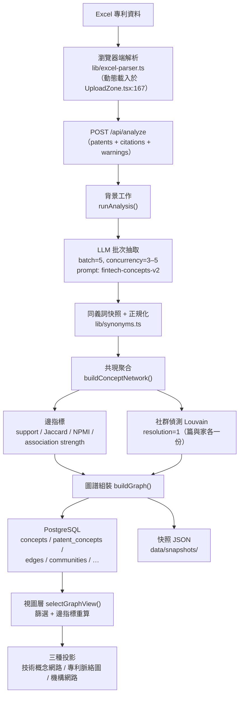

# 系統架構章節撰寫材料與改造建議

- **文件版本**：v1.0
- **建立日期**：2026-08-20
- **配套文件**：公式與參數的單一事實來源見 `docs/知識圖譜分析結果解讀與概念抽取方法.md`（v2.4）；文獻依據與審稿人質疑見 `docs/文獻對應與方法正當性.md`（v1.0）
- **用途**：(1) 提供論文「系統架構」章節可直接改寫的分層描述與資料流；(2) 依文獻對應的結果，列出該改哪裡、為什麼、成本多少。
- **核實方式**：本檔所有架構陳述於 2026-08-20 逐項回查程式碼與 `db/migrations/*.sql`，位置以 `檔案:行號` 標註。

---

## 一、架構事實：這是一個四層系統

### 1.1 分層表

| 層 | 職責 | 關鍵模組 | 執行位置 |
| --- | --- | --- | --- |
| **表現層** | 圖形渲染、視圖控制（來源檔／IPC／年份／單位／門檻／著色）、側欄檢視、匯出 | `components/GraphViewer.tsx`（1,732 行）、`components/GraphLayout.tsx`、`components/Sidebar/*`、`lib/graph-view.ts`（1,289 行） | 瀏覽器 |
| **分析層** | 概念抽取、同義詞正規化、共現聚合、指標計算、社群偵測、圖譜組裝 | `lib/llm/extractor.ts`、`lib/synonyms.ts`、`lib/concept-network.ts`、`lib/concept-metrics.ts`、`lib/community.ts`、`lib/graph-builder.ts` | 伺服器（背景工作） |
| **資料層** | 關聯式持久化、schema 版本相容、分析歷史 | `lib/db/*.ts`、`db/migrations/001–008`、`lib/graph-compat.ts` | PostgreSQL 16 |
| **接入層** | 認證與授權、上傳、任務排程與進度推送、匯出端點 | `app/api/**/route.ts`（14 個端點）、`lib/db/sessions.ts`、`lib/store.ts` | 伺服器 |

技術棧：Next.js 16.2.7 / React 19.2.4 / PostgreSQL 16 / `graphology` 0.26 + `graphology-communities-louvain` 2.0.2 / `vis-network` 10.1.0 / Vercel AI SDK 6.0；容器化以 `Dockerfile` + `docker-compose.yml`（app + db + cloudflared）。

### 1.2 資料流（論文可照此畫架構圖）

### 1.3 資料層 schema（`db/migrations/001–008`）

`users`、`sessions`、`uploads`、`analyses`、`applicants`、`patents`、`patent_applicants`、`concepts`、`patent_concepts`、`communities`、`edges`、`citations`、`citation_edges`、`analysis_uploads`、`synonym_groups`、`concept_communities`。

三個對論文有用的設計：

1. **`analyses.methodology jsonb`**（`001_init.sql:78`）記錄 `prompt_version`、`model_provider`、`model_id` —— 生成條件隨分析一起存，不靠外部筆記。
2. **`patent_concepts` 是概念與專利的隸屬關係表** —— 這一張表就足以重算所有共現指標與社群，不需重呼叫 LLM（第四節第 1 項的技術前提）。
3. **同義詞快照不可變** —— 每次分析記錄當時實際合併了哪些詞（`app/api/analyze/route.ts:144-145`），事後改詞表不會回頭改寫舊分析。
4. **遷移全為 additive**（`002`、`003` 檔頭自述：只有 `CREATE TABLE` 與 `ADD COLUMN`，無 `DROP`）—— schema 演進不破壞既有分析，`lib/graph-compat.ts` 另負責 v2／v3 舊資料載入。

---

## 二、論文「系統架構」章節建議結構

| 小節 | 該寫什麼 | 取材位置 |
| --- | --- | --- |
| 3.1 系統概觀 | 四層分層表（§1.1）+ 一句話說明為何分層：抽取、聚合、呈現三者的可變性不同（模型會換、指標會換、視圖會換），分層讓它們各自可替換 | §1.1 |
| 3.2 資料處理流程 | §1.2 的流程圖 + 每階段的輸入輸出與參數（批次 5、並行 3–5、每篇 5–10 概念） | §1.2、系統文件 §6.1 |
| 3.3 概念抽取模組 | 提示詞規則七條、信心分類三級、JSON 解析失敗最多重試三次的失敗行為 | 系統文件 §6.2–§6.4 |
| 3.4 圖譜建構與指標 | 共現聚合、四個指標的公式與**用途分工**、社群偵測設定 | 系統文件 §2、§9.4、§12.4 |
| 3.5 資料持久化與可重現性 | schema 概覽 + §1.3 的四個設計 + 系統文件 §13 參數表（當附錄） | §1.3、系統文件 §13 |
| 3.6 視覺化與互動 | 三種投影、視圖控制、以及「距離與線寬是視覺編碼而非統計量」的明確聲明 | 系統文件 §5、§12 |
| 3.7 系統驗證 | 42 個測試檔涵蓋解析、指標、社群、視圖選擇、匯出、schema 遷移與權限；說明測試驗的是**系統行為正確性**，不是抽取品質正確性（後者見限制節） | `tests/`（42 檔） |

**寫作紀律**：3.7 必須明確區分「軟體測試」與「抽取品質校驗」。42 個測試證明公式被正確實作，不證明 LLM 抽出的概念是對的。把兩者混寫是審稿人最容易抓的漏洞。

---

## 三、三個必須誠實寫進論文的架構事實

1. **Excel 在瀏覽器端解析**（`components/UploadZone.tsx:167` 動態載入 `parseExcelFiles`），解析結果經請求體轉送伺服器（`app/api/analyze/route.ts` 的 `ParserContext` 註解已自述此設計）。
   → 論文影響：資料前處理發生在客戶端，因此**前處理的環境（瀏覽器版本、檔案編碼）屬於再現條件之一**。應在方法節載明。另注意 `proxy.ts` 存在時 Next 的請求體預設緩衝上限，大檔需確認未被靜默截斷。

2. **分析任務狀態存在記憶體**（`lib/store.ts:22-23` 的 `Map`）。
   → 論文影響：不影響方法正確性，但**伺服器重啟會遺失進行中的任務**。若論文要聲稱系統可用於長時間大批次分析，需說明此限制或改為持久化任務狀態。

3. **社群劃分在分析時凍結，視圖層不重算**。`detectCommunities()`（`lib/community.ts:29`，篇單位）與 `detectUnitCommunities()`（`lib/concept-metrics.ts:194`，家單位）都在 `buildGraph()` 階段執行（`lib/graph-builder.ts:356`），視圖層只重算邊指標（`lib/graph-view.ts:747`）。
   → 論文影響：目前**無法在介面上改變 resolution 或社群邊權重**，所以第四節第 1、2 項是做敏感度分析的前提。

---

## 四、改造建議（依優先序；每項都附文獻理由與程式位置）

### 建議 1：加一條「從資料庫重算」路徑 —— 其他所有建議的前提

- **為什麼**：`patent_concepts` 已保存概念與專利的完整隸屬關係，因此共現支持數、Jaccard、NPMI、association strength 與 Louvain **全部可以從資料庫重算，不需重呼叫 LLM**。目前沒有這條路徑，任何參數調整都得重跑整批抽取（成本與時間都不可接受），這是「做不了敏感度分析」的真正原因——不是方法問題，是架構缺口。
- **改哪裡**：新增一個 recompute 入口（例如 `POST /api/analyses/[id]/recompute`），從 DB 讀 `patent_concepts` 重建 `ConceptNetworkResult`，再走既有的 `computeUnitMetrics` 與 Louvain；結果寫成**新的分析記錄**而非覆寫原記錄（保留可追溯性）。
- **成本**：中等（一個端點 + 一個從 DB 反建 concept network 的函式）。所有下游計算函式都已存在且為純函式，可直接複用。
- **論文效益**：一次解鎖審稿人質疑第 2、3 項（指標選擇與 resolution），且讓「參數敏感度分析」從不可能變成幾分鐘的事。

### 建議 2：社群偵測的邊權重與 resolution 參數化

- **為什麼**：目前兩處 Louvain 都用**原始 support 當邊權重**、resolution 硬編為 1：
  - `lib/community.ts:42` 加邊時 `weight: edge.support_count ?? 1`；`lib/community.ts:59` 設 `resolution: 1`（同處 `randomWalk: false`）
  - `lib/concept-metrics.ts:209` 加邊時 `weight: applicants.size`；同檔 `:220` 同樣 `resolution: 1`
  
  van Eck & Waltman (2009) 的結論是共現資料應以機率式指標標準化；Waltman, van Eck & Noyons (2010) 進一步把 VOS 映射與**加權、參數化**的模組度分群統一於同一原理。以未標準化的 support 分群，會讓高頻概念因規模效應吸附鄰居。此外 Fortunato & Barthélemy (2007) 的解析度極限意味著單一 resolution 值必然有偏，Louvain 還可能產出不連通社群（Traag et al., 2019）。
- **改哪裡**：把兩處的 louvain 呼叫抽成單一 helper（例如 `runLouvain(graph, { resolution, weightMode })`），`weightMode` 支援 `support` 與 `association`；預設保持 `support` 以不改變既有結果，另允許呼叫端指定。順手加一個社群連通性檢查（graphology 可直接查每個社群的子圖連通分量）。
- **成本**：小（兩處呼叫點 + 一個 helper；兩處目前是重複實作，抽取後反而更少程式碼）。
- **論文效益**：可報告「resolution ∈ {0.7, 1.0, 1.5} × 權重 ∈ {support, association strength} 六組設定下群集穩定性」，直接回應審稿人質疑第 2、3 項。

### 建議 3：決定預設邊權重指標，並在系統中顯示所依據的文獻立場

- **為什麼**：見 `文獻對應與方法正當性.md` §2.2 —— 你會引用來證明「有做標準化」的 van Eck & Waltman (2009)，建議的恰是你未設為預設的 association strength。
- **改哪裡**：`components/GraphViewer.tsx:294`（`cooccurrenceWidth`）的預設指標；以及邊詳細面板（`components/Sidebar/EdgeInfo.tsx`）標示各指標用途。
- **建議做法**：**不改預設**（Jaccard 值域固定 [0,1]、語意直觀，作為視覺編碼合理），改為在方法節明確寫「線寬為視覺編碼，定量篩選與排序一律使用 association strength」，並用建議 2 的敏感度分析支撐。若審稿意見要求，再改預設。
- **成本**：零（純論文寫作）到小（若決定改預設）。
- **注意**：這是**需要你拍板的決定**，不是純技術問題——改預設會改變論文中所有圖的線寬與結果數字。

### 建議 4：機構邊也提供標準化指標

- **為什麼**：機構邊寬目前是 `min(8, 1 + 1.4√support)`（`components/GraphViewer.tsx:260`），support 未標準化。Zhou et al. (2007) 指出單模投影必然損失資訊、需適當加權；未標準化時大型機構會與所有人連上強邊。另外投影會把共享同一概念的機構變成完全圖，使密度與集聚係數被系統性高估。
- **改哪裡**：`lib/concept-metrics.ts` 已有 `pairApplicantSupport`，可比照 `computeUnitMetrics` 為機構對計算 Jaccard／association strength；`components/GraphViewer.tsx:260` 加一個指標切換。
- **成本**：小到中等。
- **論文效益**：若論文要報告機構網路的任何網路層級指標（density、centrality 排名），這是必要前置；若只做定性描述，可先只在限制節揭露偏誤。

### 建議 5：加時間切片視圖（取代／補強中位年箭頭）

- **為什麼**：中位年箭頭是本系統最缺文獻支撐的設計（`文獻對應與方法正當性.md` §2.8）。文獻慣例是時間切片網路——Mohammadi et al. (2025) 在 *Scientific Reports* 上就是切成三期各建一張網路。
- **改哪裡**：年份範圍篩選已經存在且三視圖共用（`CONTEXT.md` 已定案），所以「切片」在功能上幾乎已具備：需要的是**把同一分析在 2–3 個年份區間各跑一次社群並並排比較**。既有的比較圖（`lib/graph-compare.ts`、`components/CompareSetupPanel.tsx`）目前比的是「來源檔」，把比較維度擴充為「年份區間」即可複用整套比較與匯出管線。
- **成本**：中等（比較維度抽象化），但複用率高。
- **論文效益**：把箭頭降級為互動探索功能，同時取得一個符合慣例、可寫進結果章的演化分析。**這是唯一能讓結果章變厚的建議。**

### 建議 6：持久化原始 LLM 回應（審計用）

- **為什麼**：目前資料庫**沒有任何表存原始 LLM 回應**（已 grep `db/migrations/*.sql` 確認無 `raw_response`／`extraction` 相關表）。抽取結果被拆解為 `concepts`／`patent_concepts`／`edges` 後，清理前的原始輸出（含被去重或丟棄的項目）就消失了。
- **影響**：(a) 無法事後審計「清理規則丟掉了什麼」；(b) 人工校驗研究（審稿人質疑第 1 項）需要比對的是**模型原始輸出 vs 專家標註**，不是清理後的結果；(c) 若要換清理規則重跑，只能重呼叫 LLM。
- **改哪裡**：新增 additive 遷移 `009_extractions.sql`：`analysis_id`、`patent_id`、`raw_response jsonb`、`prompt_version`、`model_id`、`attempt_count`；在 `runAnalysis()`（`app/api/analyze/route.ts:117` 之後）寫入。
- **成本**：小（一個遷移 + 一處寫入）。
- **優先序說明**：排在建議 1 之後是因為重算能力不依賴它；但**若要做人工校驗研究，它是前提**——而人工校驗是五個審稿人質疑中唯一不補就可能致命的一項。若確定要做校驗，此項應提升為第 2 順位。

### 建議 7（低優先）：抽取數量參數化

- **為什麼**：每篇 5–10 個概念寫在提示詞裡（`lib/llm/extractor.ts`）。Mohammadi et al. (2025) 對抽取數量做了 N=10／15／25 的敏感度測試，你沒有。
- **改哪裡**：把數量做成提示詞參數，並隨 `methodology` 記錄。
- **成本**：小，但**每組設定都要重新呼叫 LLM**，實驗成本高於程式成本。
- **建議**：除非審稿意見要求，先不做；在限制節說明「概念數上下限固定為 5–10，未做敏感度測試」即可。

---

## 五、不建議做的事（避免過度工程）

- **不要改 Louvain 為 Leiden 當預設**。Traag et al. (2019) 的保證確實更好，但換演算法會改變所有既有結果，且與你引用的先例（同樣用 Louvain）失去可比性。**改為：加一個社群連通性檢查（建議 2 順手做），在限制節引用 Traag et al. 說明已檢查連通性。** 成本相差一個數量級，論文效果幾乎相同。
- **不要為了論文重構表現層**。`GraphViewer.tsx` 1,732 行、`GraphLayout.tsx` 1,476 行確實偏大，但架構章節寫的是分層與資料流，不是單檔行數。重構有工程價值、無論文價值，且會冒風險動到已通過測試的呈現行為。
- **不要把距離或線寬改成可宣稱的定量指標**。系統文件 §5、§12.3 目前的自我限制是加分項，不是缺陷。

---

## 六、建議的執行順序

| 順序 | 項目 | 產出 | 是否需你拍板 |
| --- | --- | --- | --- |
| 1 | 建議 1（重算路徑）+ 建議 2（權重與 resolution 參數化） | 敏感度分析能力 | 否，可直接做 |
| 2 | 跑六組敏感度設定，記錄群集穩定性 | 論文方法節與附錄的一張表 | 否 |
| 3 | 建議 3（拍板預設指標並寫進方法節） | 論文段落 | **是** |
| 4 | 建議 6（原始回應落地）→ 人工校驗研究 | 論文最關鍵的一塊證據 | **是**（需投入標註人力） |
| 5 | 建議 5（時間切片） | 結果章的演化分析 | **是**（範圍決定） |
| 6 | 建議 4（機構邊標準化） | 視論文是否報告機構網路指標 | **是** |

**若時間有限只能做兩件**：建議 1 + 2（解鎖敏感度分析），以及建議 6 + 人工校驗（補最致命的缺口）。其餘皆可在限制節誠實揭露。

---

## 七、UI 影響評估：每項改動「畫面會變成怎樣」

> 本節於 2026-08-20 逐項回查現有 UI 元件確認。目的是在動工前先知道哪些改動會動到使用者看到的畫面。

### 7.1 先講三個現況事實（決定了下面的影響範圍）

1. **共現線寬指標已經有狀態與 URL 參數，但側欄沒有任何切換器。** `edgeWeight` 狀態在 `components/GraphLayout.tsx:173`（預設 `"jaccard"`），會寫進分享網址的 `el` 參數（`GraphLayout.tsx:854`），但 `setEdgeWeight` 只在解析網址時被呼叫（`GraphLayout.tsx:344`）——**目前只能靠改網址切換指標**。型別 `EdgeWeightMetric = "jaccard" | "npmi"`（`lib/graph-view.ts:43`）也還沒有 association strength。
2. **四個指標的數值早就都顯示在邊詳細面板了。** `components/Sidebar/EdgeInfo.tsx:151-189` 已同時列出支持度（篇／家）、Jaccard（兩單位）、NPMI（兩單位）與 association strength。資料齊全，缺的只是「用哪個當線寬」的入口。
3. **社群劃分在分析時凍結，視圖層只重算邊指標**（`lib/graph-builder.ts:356` vs `lib/graph-view.ts:747`）。這一條直接決定：**resolution 不能做成即時篩選器**，否則使用者拉動滑桿後圖不會變。

### 7.2 逐項 UI 影響

| 建議 | UI 影響 | 畫面會變成怎樣 |
| --- | --- | --- |
| **1 重算路徑** | 有，小 | 分析歷史側欄（`AnalysisHistorySidebar.tsx`）每列目前是「檔名 + 日期 + 刪除鈕」，會多一個「以不同參數重算」動作；點開一個對話框選 resolution／社群邊權重／預設指標；送出後歷史清單**多出一列新記錄**，需標示「重算自 ⟨原分析⟩」以免與新上傳的分析混淆。**既有分析的畫面完全不變。** 附帶好處：重算從資料庫讀取，不經 `POST /api/analyze` 的 8MB 請求體上限（`lib/analyze-limits.ts:64`），不必重新上傳檔案 |
| **2 權重與 resolution 參數化** | 有，但**不可做成即時篩選器** | 因 §7.1-3，控制項必須放在建議 1 的重算對話框，不能放進側欄「篩選器」區。重算後的新記錄裡，**社群色會整批改變**、「技術社群」清單（`Sidebar/index.tsx:908`）的群數與群名（取群內度數最高概念）都可能不同。原記錄不動，兩者可並排比較 |
| **3 預設／可切換邊權重指標** | 有 | 若只是「不改預設、在論文寫清楚」→ **UI 零變更**。若要讓敏感度分析在介面上可用 → 在「分析單位」「概念顏色」旁新增一組「共現線寬指標」按鈕（Jaccard／NPMI／association strength），按下後**所有共現實線粗細立即重畫**；右下角浮動圖例（`FloatingLegend.tsx`）目前**只說明顏色、完全沒有線寬說明**，需補一行「線寬＝⟨指標⟩」；型別 `EdgeWeightMetric` 需擴充第三個值 |
| **4 機構邊標準化** | 有 | 機構網路的邊粗細改變（現為 `min(8, 1 + 1.4√support)`，`GraphViewer.tsx:260`）；機構邊的詳細面板會多出標準化指標列（目前只有支持度）；若也要切換器，機構視圖需各自一組 |
| **5 時間切片** | **最大** | 比較面板現行規則是「每個面板各自選來源檔，其餘（年份、單位、著色、IPC）各面板共用」（`CompareSetupPanel.tsx:65-66` 的說明文字明文如此）。要做時間切片，**年份範圍必須從共用改為每面板獨立** → 每張面板卡片多一個 `YearFilter`，那句說明文字要重寫；比較圖例（`DiffLegend.tsx`）的「僅 A／僅 B／共有」語意從「哪個來源檔有」變成「哪個時期有」，文案與圖例標籤都要改 |
| **6 原始 LLM 回應落地** | **零** | 純資料層與遷移，畫面完全不變 |
| **7 抽取數量參數化** | 有，小 | 上傳／分析設定畫面（`UploadZone.tsx`）多一個數字輸入（每篇概念數上下限），並隨 `methodology` 記錄 |

### 7.3 依 UI 風險排序的建議做法

- **零 UI 風險、可立刻做**：建議 6（原始回應落地）、建議 3 的「不改預設、只寫論文」版本。
- **低 UI 風險**：建議 1 + 2 —— 新增一個對話框與一個歷史側欄動作，不動任何既有視圖的呈現邏輯。既有分析畫面保持不變，這是刻意的：**論文已產生的圖不會因為系統改版而失效**。
- **中 UI 風險**：建議 3 的切換器版（動到線寬呈現與圖例）、建議 4（動到機構視圖呈現）。這兩項都碰 `GraphViewer.tsx` 的邊呈現路徑，驗收必須實際開圖看，typecheck／單元測試對線寬與圖例是零覆蓋。
- **高 UI 風險**：建議 5 —— 改動比較面板的核心假設（哪些條件共用、哪些各面板獨立），影響比較圖、比較摘要、圖例與匯出四處。建議獨立一輪做，不要和其他項混在同一次變更。

---

## 八、決策紀錄（2026-08-20 與使用者逐項確認）

以下九項為使用者拍板結果，取代第四節與第六節中「需你拍板」的欄位。

| # | 項目 | 決定 | UI 影響 |
| --- | --- | --- | --- |
| 1 | 人工校驗研究 | **不做**（無標註人力）。論文定位鎖在「候選知識圖譜」，`論文方法章節撰寫指引.md` §2 的定位句可直接使用 | — |
| 2 | 論文主張層級 | 定量發現型，但**結論類型（聚合層級 vs 個別概念排名）未定** → 先完成 #6、#8 產出資料，再定主張 | — |
| 3 | 共現線寬指標 | **維持 Jaccard**。判斷依據：van Eck & Waltman (2009) 主張的是「共現資料作為分群輸入時應以機率式指標標準化」，對象不是線條粗細 | **零**（論文已產生的圖不失效） |
| 4 | association strength 的用途 | 改用在 **Louvain 的邊權重**（現為原始 support）。社群逐分析凍結，改預設不影響既有分析 | 零（僅新記錄改變） |
| 5 | resolution | 參數化，控制項放**重算對話框**而非側欄篩選器（放側欄會出現「拉了圖不變」的假象）。兩處硬編抽成單一 helper，順手加社群連通性檢查 | 對話框內 |
| 6 | 重算路徑 | **做**。不呼叫 LLM；多接年份區間參數；產生新分析記錄，不覆寫原記錄 | 歷史側欄多一動作 + 一個對話框 |
| 7 | 機構邊標準化 | 只算 Jaccard／assoc **顯示於邊詳細面板**，線寬維持 `√support`。純 view 層 | **零**（機構圖外觀不變） |
| 8 | 時間切片 | 走 #6 的重算路徑 + 年份區間，**每期各自跑 Louvain**。不動比較面板 | 零 |
| 9 | 原始 LLM 回覆 | **存，且加記清理前後差異**（去重／同義詞合併／丟棄各幾項）→ 限制節可寫具體數字 | **零** |

### 8.1 延後事項與其硬性條件

- **時間切片的切點規則**：等正式資料到手，先只畫「每年幾件」成長曲線觀察轉折數量，再定規則。
  **硬性條件：規則必須在跑任何圖譜分析之前寫進文件並註明日期**（只畫成長曲線不算跑分析），否則構成事後選擇（post-hoc selection），而事後選擇的指控在方法上無法反駁。
- **結論類型**：完成 #6、#8 後依實際資料決定。屆時會再遇到「無人工校驗 + 定量主張」的張力 —— 若最終要寫「A 與 B 關聯最強」這類依賴個別概念正確性的句子，只有兩條路：補小規模來源回查（僅查寫進論文的 10–20 個高點概念），或改寫為聚合層級陳述。

### 8.2 資料前提（重要）

`專利爬蟲.xlsx`（1500 筆、申請年 1986–2025）**是測試資料，不是正式研究資料**。其年份分布只能用於管線驗證，**不得**用來決定切點、門檻或任何論文參數。正式資料到手後所有分布相關判斷須重算。

尚待使用者提供的事實：正式資料的**筆數與時程**。系統上限為 20,000 筆、單次請求體 8MB（`lib/analyze-limits.ts:64`，受 Next proxy 10MB 緩衝上限約束）；測試資料 1500 筆的請求體約 2–3.5MB，若正式資料達一萬筆以上，上傳路徑需先評估。
